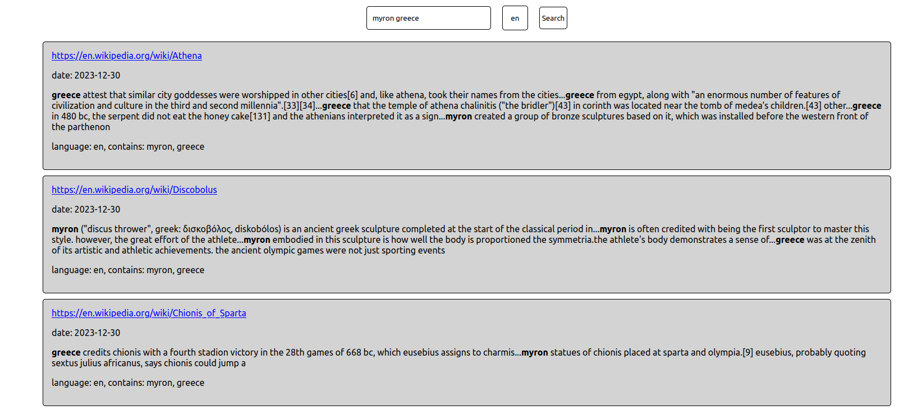
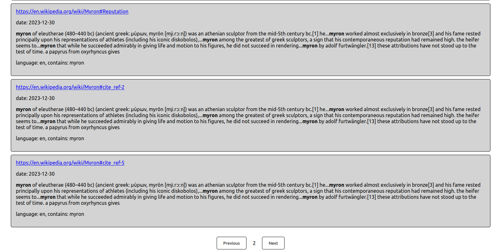

# Minimalistic Search Engine

This project comprises two main components: a web crawler and a search engine, both of which are integral to the functionality of this custom search engine solution.

## Web Crawler

The web crawler can be controlled (started and stopped) via a Flask server. It performs the following functions:

- Sends requests to web pages.
- Archives webpages as text files along with their metadata.
- Utilizes a thread pool for efficient operation, as both requesting and writing to disk are IO-bound tasks.

## Search

The search engine component operates on the data collected by the web crawler. Its operations are as follows:

1. **Inverted Index Creation**: It processes the archived text files to create an [inverted index](https://en.wikipedia.org/wiki/Inverted_index), allowing for efficient computation of the set of documents containing at least one of the search words.

2. **Sorting Mechanism**: The sorting of search results is a multi-stage process:

   - First, sort by the count of search words contained in each document.
   - Next, prioritize language matches. Language detection is performed using Python's `langdetect` library, with the probability of detection factored in. English is set as the fallback language and is prioritized over other languages if the requested language is not found.
   - Then, sort by [TF-IDF](https://en.wikipedia.org/wiki/Tf%E2%80%93idf) similarity. Each document-word pair has a TF-IDF score, which can be calculated using both the forward and inverted indexes. The scores are summed over the search words to maximize relevance.
   - Finally, minimize the minimal position variance. For each word in the document that matches a search word, find the position such that the variance between these positions is minimized, thereby improving locality.

3. **Forward Index**: A [forward index](https://en.wikipedia.org/wiki/Forward_index) is created for the snippets of text.

## Screenshots

Below are screenshots of the search engine interface:





## What is Missing

While the current implementation of the search engine and web crawler provides a solid foundation, there are several areas where enhancements could be made to approach the sophistication of a full-fledged search engine:

1. **More Intelligent Web Crawler**: The crawler could be made more intelligent by adapting its crawling strategy based on the content it encounters. For instance, it could prioritize crawling documents that are different from the ones already seen, diversifying the content in the database.

2. **Improved Search Engine**:
   - **Document Diversity**: Implementing a mechanism to avoid showing documents that are very similar to each other in the search results could improve user experience by providing a wider range of information.
   - **Use of PageRank Algorithm**: Integrating a PageRank-like algorithm could help in ranking web pages based on their importance and relevance, similar to how Google ranks search results.
   - **Categorization**: Adding categories such as "Sports", "Shopping", "News", etc., to search results, akin to Google's categorization. This would require a classification system capable of categorizing documents accurately.
   - **Autocomplete Feature**: Enhancing the search bar with an autocomplete feature using advanced algorithms such as Recurrent Neural Networks (RNNs), Hidden Markov Models, or Transformers. This would make the search experience more user-friendly and efficient.

3. **Additional Features**:
   - **User Personalization**: Tailoring search results based on user preferences and search history.
   - **Advanced Filtering Options**: Allowing users to filter results by date, region, file type, etc.
   - **Search Analytics**: Providing analytics on search trends and popular queries.

## How to Run the Search Engine Yourself

To get the search engine up and running on your local machine, follow these steps:

1. **Clone the Repository**:
   First, clone the repository to your local machine using Git. Open your terminal or command prompt and run the following command:
   ```
   git clone https://github.com/damiha/SearchEngineGPTClone
   ```

2. **Start the Frontend**:
   Change directory into the frontend folder and start the application:
   ```
   cd search-frontend
   npm start
   ```
   This will start the React frontend. By default, it should be accessible at `http://localhost:3000`.

3. **Start the Backend Server**:
   Open a new terminal window or tab. Switch back to the parent directory of the project, then start the backend server:
   ```
   cd ..
   python3 app.py
   ```
   This will start the Flask backend server.

4. **Initial Setup for Crawling**:
   Initially, the 'webpages' folder will be missing. To start crawling, you need to send a POST request to the crawler. This can be done using tools like ThunderClient, Postman, or any other API testing tool.
   Send a POST request to `http://127.0.0.1:5000/crawler/start`.

5. **Check Crawler Status**:
   To check the status of the crawler, including the number of pages crawled and the requests per second, as well as the number of pages in the queue, send a GET request to `/crawler/info`.

6. **Stop the Crawler**:
   When you're ready to stop the crawler, send a POST request to `/crawler/stop`. This action will automatically update the indices of the search engine.

7. **Using the Frontend**:
   With the backend running and after some pages have been crawled and indexed, you can use the frontend. Simply type your query into the search bar and hit the "search" button to see the results.


